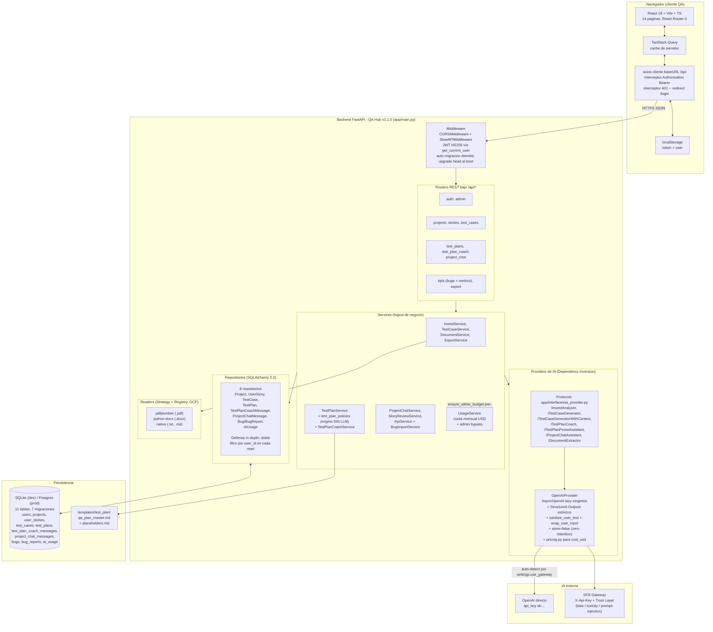
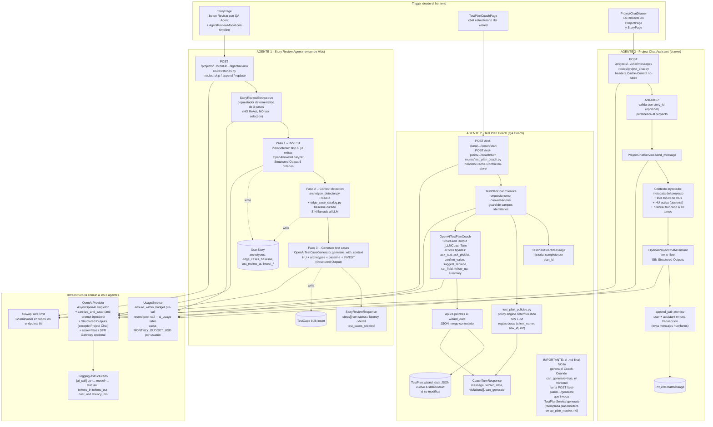

# Arquitectura — `propuesta-2-test-manager/`

Documento de referencia con dos diagramas:

1. **Arquitectura general** del sitio (frontend → backend → DB → IA externa).
2. **Estructura de los agentes de IA** (Story Review Agent, Test Plan Coach, Project Chat Assistant) y su pipeline interno.

> Los bloques `mermaid` se renderizan en GitHub, en VS Code/Cursor con la extensión adecuada, o pegándolos en [mermaid.live](https://mermaid.live) para exportar a PNG/SVG.

---

## Glosario rápido de los agentes

El sistema corre **3 agentes de IA distintos**. Los nombres más comunes se mapean así:

- **"QA Agent que revisa HUs"** → **Story Review Agent**. Pipeline determinístico de 3 pasos detrás del botón "Revisar con QA Agent" en `StoryPage`. Endpoint: `POST /api/projects/{pid}/stories/{sid}/agent/review`.
- **"QA Coach"** → **Test Plan Coach**. Chat estructurado que va llenando el wizard del Test Plan. Endpoint: `POST /api/test-plans/{planId}/coach/turn`. Página dedicada `TestPlanCoachPage`.
- **Project Chat Assistant** (no confundir con el Coach): chatbot Q&A flotante (`ProjectChatDrawer`) para preguntar sobre el proyecto / HU activa. Endpoint: `POST /api/projects/{pid}/chat/messages`. **No** modifica nada, solo responde.

---

## Diagrama 1 — Arquitectura general del sitio

### Cómo leerlo

- **Capas estrictas** (Layered Architecture): `routes → services → repositories → models`. Toda la inyección está centralizada en [`backend/app/dependencies.py`](../backend/app/dependencies.py).
- **Dos cuellos transversales** que tocan toda llamada de IA: `UsageService` (cuota mensual de USD por usuario, valida antes y registra después) y el rate limit de slowapi (`120/min/user` en endpoints IA, `600/min/user` global, key por `sub` del JWT).
- **Provider abstracto via Protocols**: el día que se cambie de OpenAI a otro modelo solo se reemplaza la clase concreta en [`backend/app/providers/openai_provider.py`](../backend/app/providers/openai_provider.py). El gateway de Salesforce Research se activa solo si la API key no empieza con `sk-`.
- **El frontend es un SPA puro** consumiendo `/api`. En Heroku, FastAPI sirve el `dist/` del frontend con `_SPAStaticFiles` (fallback a `index.html` para 404 no-API).

---

## Diagrama 2 — Estructura de los agentes de IA

### Diferencias clave entre los 3 agentes

- **Story Review** es un **pipeline determinístico** de 3 pasos. Hay heurística (regex de archetypes + lookup de catálogo) **antes** del LLM, lo que reduce variabilidad y costo. Una corrida típica gasta 1-2 calls al modelo ($0.005-$0.020 USD).
- **Test Plan Coach** es **conversacional con structured output**: cada turno del LLM devuelve un `assistant_message` + un `next_action` tipado (`ask_text`, `ask_picklist`, `confirm_value`, etc.) que el frontend renderiza como un widget interactivo. Encima del LLM hay un policy engine determinístico (`test_plan_policies.py`) que valida reglas duras y bloquea la generación si no se cumplen.
- **Project Chat** es **conversacional libre**: solo Q&A, no modifica nada del proyecto. Es texto plano, sin Structured Outputs.

---

## Archivos clave por agente

**Story Review Agent**:

- Routes: [`backend/app/routes/stories.py`](../backend/app/routes/stories.py)
- Servicio orquestador: [`backend/app/services/story_review/story_review_service.py`](../backend/app/services/story_review/story_review_service.py)
- Detección de arquetipos: [`backend/app/services/story_review/archetype_detector.py`](../backend/app/services/story_review/archetype_detector.py)
- Catálogo de edge cases: [`backend/app/services/story_review/edge_case_catalog.py`](../backend/app/services/story_review/edge_case_catalog.py)
- Provider: clases `OpenAIInvestAnalyzer` y `OpenAITestCaseGenerator.generate_with_context` en [`backend/app/providers/openai_provider.py`](../backend/app/providers/openai_provider.py)
- Frontend: [`frontend/src/pages/StoryPage.tsx`](../frontend/src/pages/StoryPage.tsx) (botón + `AgentReviewModal`)

**Test Plan Coach (QA Coach)**:

- Routes: [`backend/app/routes/test_plan_coach.py`](../backend/app/routes/test_plan_coach.py)
- Servicio: [`backend/app/services/test_plan_coach_service.py`](../backend/app/services/test_plan_coach_service.py)
- Policy engine determinístico: [`backend/app/services/test_plan_policies.py`](../backend/app/services/test_plan_policies.py)
- Provider: clase `OpenAITestPlanCoach` en [`backend/app/providers/openai_provider.py`](../backend/app/providers/openai_provider.py)
- Frontend: [`frontend/src/pages/TestPlanCoachPage.tsx`](../frontend/src/pages/TestPlanCoachPage.tsx)
- Generación final del `.md` (separada del Coach): [`backend/app/services/test_plan_service.py`](../backend/app/services/test_plan_service.py) + plantilla [`backend/app/templates/test_plan/qa_plan_master.md`](../backend/app/templates/test_plan/qa_plan_master.md)

**Project Chat Assistant**:

- Routes: [`backend/app/routes/project_chat.py`](../backend/app/routes/project_chat.py)
- Servicio: [`backend/app/services/project_chat_service.py`](../backend/app/services/project_chat_service.py)
- Provider: clase `OpenAIProjectChatAssistant` en [`backend/app/providers/openai_provider.py`](../backend/app/providers/openai_provider.py)
- Frontend: [`frontend/src/components/ProjectChatDrawer.tsx`](../frontend/src/components/ProjectChatDrawer.tsx)
